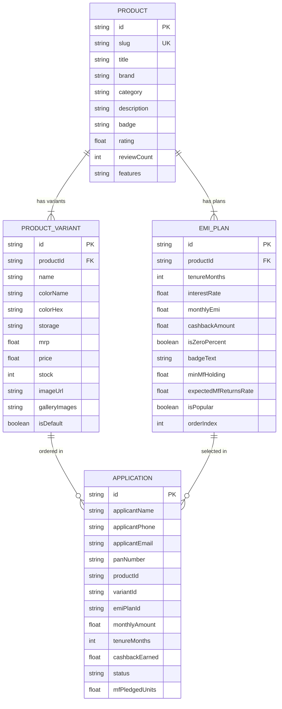

# 1Fi SDE1 Assignment - Mutual Fund-Backed Smartphone EMI Web App

A production-ready full-stack web application that showcases flagship smartphones with flexible **EMI plans backed by mutual funds**, built according to the **1Fi SDE-1 Assignment** specification.


---

## 🌟 Key Features

1. **Dynamic Product & Variant System**:
   - Unique, dedicated URLs for each product:
     - `/products/iphone-17-pro`
     - `/products/samsung-s24-ultra`
     - `/products/google-pixel-9-pro`
     - `/products/oneplus-12`
   - Real-time specification switching (Storage options: 128GB, 256GB, 512GB, 1TB; Finishes: Titanium Desert, Natural, Black, White, etc.).
   - Switching variants automatically recalculates prices, savings, and all monthly installment amounts across all tenures dynamically.

2. **Mutual Fund-Backed EMI Plans (Pixel-Perfect UI)**:
   - Designed to match the exact reference layout from the assignment specification.
   - Tenures: **3, 6, 12, 24, 36, 48, and 60 months**.
   - Interest rates: **0% interest** zero-cost tenures and **10.5% interest** extended tenures.
   - Cashback tags: Highlighted cashback values (e.g., `Additional cashback of ₹7,500`).
   - Interactive selection: Active border highlight, checkmark indicator, and live summary calculation.

3. **1Fi Intelligent Credit & Mutual Fund Explainer**:
   - Interactive *"How it works"* educational modal explaining how mutual fund pledging keeps investments compounding at ~12% p.a. while paying ₹0 down-payment EMIs without liquidating assets or triggering tax penalties.

4. **Proceed with Selected Plan Flow**:
   - Full application and KYC checkout flow.
   - Submits application directly to the backend database (`POST /api/applications`).
   - Instant simulated digital verification and approval with Application ID generation.

5. **Robust Database & REST APIs**:
   - Zero hardcoded frontend data—everything is served dynamically via REST APIs from an ORM-backed relational database (`SQLite` locally, ready for `PostgreSQL`/`Supabase` in production).

---

## 🛠️ Tech Stack

| Layer | Technology |
| :--- | :--- |
| **Frontend Framework** | React 18 + Next.js 14 (App Router) |
| **Language** | TypeScript (Strict mode) |
| **Styling** | Tailwind CSS + Vanilla CSS Tokens + Glassmorphism |
| **Icons** | Lucide React |
| **Backend & APIs** | Next.js Route Handlers (Node.js REST APIs) |
| **ORM** | Prisma ORM 5.22 |
| **Database** | SQLite (zero-config local) / PostgreSQL compatible |

---

## 🚀 Setup & Run Instructions

### Prerequisites
- **Node.js**: v18.17+ or v20+
- **npm** or **yarn** / **pnpm**

### Step 1: Clone the Repository
```bash
git clone https://github.com/<your-username>/1Fi_SDE1_Assignment.git
cd 1Fi_SDE1_Assignment
```

### Step 2: Install Dependencies
```bash
npm install
```

### Step 3: Configure Environment Variables
Create a `.env` file in the root directory (a default `.env` is already configured):
```env
DATABASE_URL="file:./dev.db"
NEXT_PUBLIC_APP_URL="http://localhost:3000"
```

### Step 4: Initialize & Seed the Database
Push the Prisma schema and run the seed script to populate products, variants, and EMI plans:
```bash
# Push schema to SQLite
npx prisma db push

# Seed 4 flagship products with multiple variants & EMI plans
npm run db:seed
```

### Step 5: Start the Development Server
```bash
npm run dev
```

Open [http://localhost:3000](http://localhost:3000) in your browser.

---

## 📡 API Endpoints & Example Responses

### 1. List All Products
- **Route**: `GET /api/products`
- **Description**: Returns all catalog products with variants and lowest monthly EMI.

#### Response:
```json
{
  "success": true,
  "count": 4,
  "data": [
    {
      "id": "cmtmti...",
      "slug": "iphone-17-pro",
      "title": "iPhone 17 Pro",
      "brand": "Apple",
      "category": "Smartphones",
      "badge": "NEW",
      "rating": 4.9,
      "reviewCount": 1842,
      "lowestEmi": 2842,
      "variantsCount": 7,
      "defaultVariant": {
        "name": "Desert Titanium 256GB",
        "colorName": "Desert Titanium",
        "colorHex": "#C5A089",
        "storage": "256GB",
        "mrp": 134900,
        "price": 127400,
        "stock": 28,
        "imageUrl": "/images/iphone-17-pro-desert.png"
      }
    }
  ]
}
```

---

### 2. Get Single Product by Slug or ID
- **Route**: `GET /api/products/:slug` (e.g. `GET /api/products/iphone-17-pro`)
- **Description**: Returns complete product details, all color/storage variants, specs, and tailored EMI plans.

#### Response:
```json
{
  "success": true,
  "data": {
    "id": "cmtmti...",
    "slug": "iphone-17-pro",
    "title": "iPhone 17 Pro",
    "brand": "Apple",
    "category": "Smartphones",
    "badge": "NEW",
    "rating": 4.9,
    "reviewCount": 1842,
    "features": [
      { "title": "Chipset", "value": "Apple A19 Pro (3nm Gen 2)" },
      { "title": "Display", "value": "6.3\" Super Retina XDR OLED, 120Hz ProMotion" }
    ],
    "variants": [
      {
        "id": "var_1",
        "name": "Desert Titanium 256GB",
        "colorName": "Desert Titanium",
        "colorHex": "#C5A089",
        "storage": "256GB",
        "mrp": 134900,
        "price": 127400,
        "stock": 28,
        "imageUrl": "/images/iphone-17-pro-desert.png"
      }
    ],
    "emiPlans": [
      {
        "id": "emi_1",
        "tenureMonths": 3,
        "interestRate": 0,
        "monthlyEmi": 44967,
        "cashbackAmount": 7500,
        "isZeroPercent": true,
        "badgeText": "0% interest"
      },
      {
        "id": "emi_2",
        "tenureMonths": 6,
        "interestRate": 0,
        "monthlyEmi": 22483,
        "cashbackAmount": 7500,
        "isZeroPercent": true,
        "badgeText": "0% interest"
      },
      {
        "id": "emi_3",
        "tenureMonths": 12,
        "interestRate": 0,
        "monthlyEmi": 11242,
        "cashbackAmount": 7500,
        "isZeroPercent": true,
        "badgeText": "0% interest"
      },
      {
        "id": "emi_5",
        "tenureMonths": 36,
        "interestRate": 10.5,
        "monthlyEmi": 4297,
        "cashbackAmount": 7500,
        "isZeroPercent": false,
        "badgeText": "10.5% interest"
      }
    ]
  }
}
```

---

### 3. Submit EMI Application ("Proceed with Plan")
- **Route**: `POST /api/applications`
- **Description**: Stores customer application in database and returns instant approval confirmation.

#### Request Body:
```json
{
  "applicantName": "Rahul Sharma",
  "applicantPhone": "9876543210",
  "applicantEmail": "rahul.sharma@example.com",
  "panNumber": "ABCDE1234F",
  "productId": "<PRODUCT_ID>",
  "variantId": "<VARIANT_ID>",
  "emiPlanId": "<EMI_PLAN_ID>",
  "monthlyAmount": 11242,
  "tenureMonths": 12,
  "cashbackEarned": 7500,
  "mfPledgedUnits": 150.0
}
```

#### Response:
```json
{
  "success": true,
  "message": "Mutual Fund backed EMI Application approved instantly!",
  "data": {
    "id": "cmtmtir560001vnpsn6wxrqme",
    "applicantName": "Rahul Sharma",
    "applicantPhone": "9876543210",
    "panNumber": "ABCDE1234F",
    "monthlyAmount": 11242,
    "tenureMonths": 12,
    "cashbackEarned": 7500,
    "status": "APPROVED",
    "createdAt": "2026-09-04T10:35:36.000Z"
  }
}
```

---

### 4. Dynamic Financial Calculator
- **Route**: `GET /api/emi-calculator?price=127400&tenure=12&interest=0&cashback=7500`
- **Description**: Computes installment breakdown, interest savings, and estimated mutual fund compounding return during tenure.

---

## 🗄️ Database Schema

The database architecture is defined in [`prisma/schema.prisma`](./prisma/schema.prisma).



---

## 🎥 2-5 Minute Video Recording Guide

When recording your demo video for submission:

1. **Introduction (30s)**:
   - Introduce yourself and explain the problem: Traditional EMIs charge high interest or require liquidating mutual funds (incurring capital gains tax). 1Fi enables users to pledge mutual funds to get 0% interest smartphone EMIs while their investments continue compounding.
2. **Product Page & Reference UI (60s)**:
   - Navigate to `/products/iphone-17-pro`.
   - Show that the UI matches the reference image: Price (`₹1,27,400`), MRP strike-through (`₹1,34,900`), and all EMI plans (3m, 6m, 12m, 24m at 0% interest, 36m, 48m, 60m at 10.5% interest, with `Additional cashback of ₹7,500`).
   - Demonstrate interactive variant switching (select 512GB / 1TB, Natural Titanium / Black Titanium) and show how price and EMI table recalculate dynamically.
3. **Interactive Features & Modal (30s)**:
   - Click "How it works" to showcase the Mutual Fund Explainer dialog.
   - Select an EMI plan (e.g. 12 months) and click **"Proceed with selected plan"**.
   - Show the application review breakdown and click **"Confirm & Pledge Mutual Funds"** to show instant approval with Application ID.
4. **Backend & Database (45s)**:
   - Show the REST API responses in your browser/terminal (`/api/products`, `/api/products/iphone-17-pro`).
   - Highlight the Prisma schema (`prisma/schema.prisma`) and seed data (`prisma/seed.ts`).
5. **Conclusion (15s)**:
   - Summarize the tech stack (Next.js 14, React, Tailwind CSS, Prisma ORM, SQLite/PostgreSQL) and wrap up.

---

## ☁️ Deployment (Vercel / Render)

### Deploy to Vercel (Recommended)
1. Push your repository to GitHub.
2. Import the repo on [Vercel](https://vercel.com).
3. Set the environment variable:
   - `DATABASE_URL`: `file:./dev.db` (or connect a free Supabase / Neon PostgreSQL database).
4. Vercel automatically runs `prisma generate` and `next build` via the `postinstall` script in `package.json`.

---

## 👨‍💻 Submission Checklist

- [x] Backend API connected to database (no hardcoded data)
- [x] Unique URLs for each product (`/products/iphone-17-pro`, `/products/samsung-s24-ultra`, etc.)
- [x] At least 3 products with 2+ variants each
- [x] Dynamic EMI calculation matching the reference screenshot
- [x] Selectable EMI plans with Proceed action
- [x] Database schema & seed data (`prisma/schema.prisma`, `prisma/seed.ts`, `prisma/seed-data.json`)
- [x] Comprehensive `README.md` with setup, API contracts, tech stack, and schema ERD
