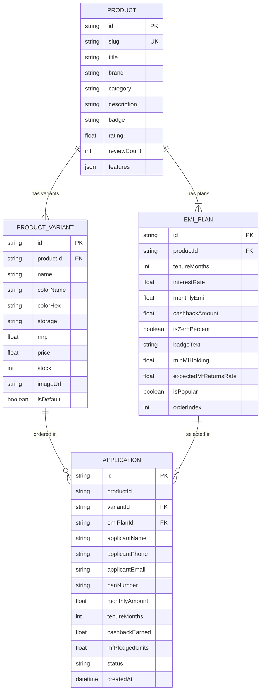

# 1Fi SDE1 Assignment — Mutual Fund-Backed Smartphone EMI Web App

> A production-ready, full-stack web application that showcases flagship smartphones with flexible **EMI plans backed by mutual funds**, built as part of the **1Fi SDE-1 Assignment** specification.

[](https://nextjs.org/)
[](https://www.typescriptlang.org/)
[](https://www.prisma.io/)
[](https://tailwindcss.com/)
[](https://www.sqlite.org/)
[](https://github.com/Aditya-9131/1fi-mutual-fund-emi-app)

---

## 📑 Table of Contents

1. [Project Overview](#-project-overview)
2. [Key Features](#-key-features)
3. [Tech Stack](#-tech-stack)
4. [Project Structure](#-project-structure)
5. [Setup & Run Instructions](#-setup--run-instructions)
6. [API Reference](#-api-reference)
7. [Database Schema](#-database-schema)
8. [Submission Checklist](#-submission-checklist)
9. [Video Demo Guide](#-video-demo-guide)
10. [Deployment](#-deployment)

---

## 🧾 Project Overview

Traditional consumer EMIs either charge high interest or require you to liquidate your mutual fund investments — triggering capital gains taxes and missing out on compounding returns.

**1Fi solves this** by letting users **pledge** their mutual fund units as collateral to unlock 0%-interest smartphone EMIs. Their portfolio stays intact and continues compounding at ~12% p.a. while they pay zero down-payment, zero interest EMIs.

This app demonstrates the full product and checkout experience, backed by a real database and REST API — zero hardcoded frontend data.

---

## 🌟 Key Features

### 1. Dynamic Product & Variant System
- Unique, SEO-friendly URLs for each product:
  - `/products/iphone-17-pro`
  - `/products/samsung-s24-ultra`
  - `/products/google-pixel-9-pro`
  - `/products/oneplus-12`
- Real-time variant switching (Storage: 128GB / 256GB / 512GB / 1TB; Color finishes: Desert Titanium, Natural, Black, White, etc.)
- Selecting a variant instantly recalculates price, MRP strike-through, savings, and all EMI monthly amounts across all tenures.

### 2. Mutual Fund-Backed EMI Plans (Pixel-Perfect UI)
- Designed to match the exact reference layout from the assignment specification.
- **Tenures**: 3, 6, 12, 24, 36, 48, and 60 months.
- **Interest rates**: 0% interest (zero-cost) for short tenures; 10.5% p.a. for extended tenures.
- **Cashback tags**: Highlighted cashback values (e.g., `Additional cashback of ₹7,500`).
- Interactive plan selection with active border highlight, checkmark indicator, and live summary recalculation.

### 3. 1Fi Intelligent Credit & Mutual Fund Explainer
- An interactive **"How it works"** modal that educates users on how mutual fund pledging works, why investments continue compounding, and why there's no capital gains tax event.

### 4. Proceed with Selected Plan Flow
- Full KYC & application checkout flow.
- Submits application to the backend via `POST /api/applications`.
- Returns instant simulated approval with a unique Application ID.

### 5. Robust Database & REST APIs
- All product, variant, and EMI data is stored in a relational database (SQLite locally, PostgreSQL-ready).
- Every page and component fetches data exclusively from REST API endpoints — no static hardcoded data in the frontend.

---

## 🛠️ Tech Stack

| Layer | Technology |
| :--- | :--- |
| **Frontend Framework** | React 18 + Next.js 14 (App Router) |
| **Language** | TypeScript (Strict mode) |
| **Styling** | Tailwind CSS + Glassmorphism tokens |
| **Icons** | Lucide React |
| **Backend & APIs** | Next.js Route Handlers (Node.js REST) |
| **ORM** | Prisma ORM 5.x |
| **Database** | SQLite (local, zero-config) / PostgreSQL compatible |
| **Package Manager** | npm |

---

## 📁 Project Structure

```
1Fi_SDE1_Assignment/
├── prisma/
│   ├── schema.prisma        # Database schema (Product, Variant, EmiPlan, Application)
│   ├── seed.ts              # Full seed script for 4 flagship products
│   ├── seed-data.json       # Raw seed data (products, variants, EMI plans)
│   └── dev.db               # SQLite database file (auto-generated)
│
├── src/
│   ├── app/
│   │   ├── layout.tsx       # Root layout with Navbar & Footer
│   │   ├── page.tsx         # Home page — Product listing grid
│   │   ├── globals.css      # Global CSS tokens and reset
│   │   ├── products/
│   │   │   └── [slug]/
│   │   │       └── page.tsx # Dynamic product detail page
│   │   └── api/
│   │       ├── products/
│   │       │   ├── route.ts              # GET /api/products
│   │       │   └── [slug]/route.ts       # GET /api/products/:slug
│   │       ├── applications/
│   │       │   └── route.ts              # POST /api/applications
│   │       └── emi-calculator/
│   │           └── route.ts              # GET /api/emi-calculator
│   │
│   ├── components/
│   │   ├── Navbar.tsx             # Top navigation bar
│   │   ├── Footer.tsx             # Site footer
│   │   ├── ProductCard.tsx        # Card used in product listing grid
│   │   ├── ProductGallery.tsx     # Image gallery with variant switching
│   │   ├── VariantSelector.tsx    # Color & storage selector
│   │   ├── EmiPlanList.tsx        # EMI plan cards with interactive selection
│   │   ├── EmiProceedModal.tsx    # KYC & confirmation checkout modal
│   │   └── MutualFundInfoModal.tsx # "How it works" educational modal
│   │
│   └── lib/
│       └── prisma.ts        # Prisma client singleton
│
├── public/
│   └── images/              # Product images
│
├── .env                     # Environment variables
├── next.config.js
├── tailwind.config.ts
├── tsconfig.json
└── package.json
```

---

## 🚀 Setup & Run Instructions

### Prerequisites
- **Node.js**: v18.17+ or v20+
- **npm** (v9+)

---

### Step 1 — Clone the Repository
```bash
git clone https://github.com/Aditya-9131/1fi-mutual-fund-emi-app.git
cd 1fi-mutual-fund-emi-app
```

---

### Step 2 — Install Dependencies
```bash
npm install
```

> This also runs `prisma generate` automatically via the `postinstall` script.

---

### Step 3 — Configure Environment Variables

A default `.env` file is already present. Verify or update it:

```env
DATABASE_URL="file:./dev.db"
NEXT_PUBLIC_APP_URL="http://localhost:3000"
```

---

### Step 4 — Initialize & Seed the Database

```bash
# Apply the Prisma schema to SQLite
npx prisma db push

# Seed 4 flagship products with variants & EMI plans
npm run db:seed
```

---

### Step 5 — Start the Development Server

```bash
npm run dev
```

Open [http://localhost:3000](http://localhost:3000) in your browser.

---

### Available npm Scripts

| Script | Description |
| :--- | :--- |
| `npm run dev` | Start local development server |
| `npm run build` | Production build (includes DB push + seed) |
| `npm run start` | Start production server |
| `npm run db:push` | Push Prisma schema to database |
| `npm run db:seed` | Seed the database with product data |
| `npm run db:studio` | Open Prisma Studio (GUI for the database) |

---

## 📡 API Reference

### `GET /api/products`
Returns all catalog products with their default variant and lowest monthly EMI.

**Example Response:**
```json
{
  "success": true,
  "count": 4,
  "data": [
    {
      "id": "cmtmti...",
      "slug": "iphone-17-pro",
      "title": "iPhone 17 Pro",
      "brand": "Apple",
      "category": "Smartphones",
      "badge": "NEW",
      "rating": 4.9,
      "reviewCount": 1842,
      "lowestEmi": 2842,
      "variantsCount": 7,
      "defaultVariant": {
        "name": "Desert Titanium 256GB",
        "colorName": "Desert Titanium",
        "colorHex": "#C5A089",
        "storage": "256GB",
        "mrp": 134900,
        "price": 127400,
        "stock": 28,
        "imageUrl": "/images/iphone-17-pro-desert.png"
      }
    }
  ]
}
```

---

### `GET /api/products/:slug`
Returns full product details including all variants and EMI plans.

**Example:** `GET /api/products/iphone-17-pro`

**Example Response:**
```json
{
  "success": true,
  "data": {
    "id": "cmtmti...",
    "slug": "iphone-17-pro",
    "title": "iPhone 17 Pro",
    "brand": "Apple",
    "features": [
      { "title": "Chipset", "value": "Apple A19 Pro (3nm Gen 2)" },
      { "title": "Display", "value": "6.3\" Super Retina XDR OLED, 120Hz ProMotion" }
    ],
    "variants": [
      {
        "id": "var_1",
        "name": "Desert Titanium 256GB",
        "colorName": "Desert Titanium",
        "colorHex": "#C5A089",
        "storage": "256GB",
        "mrp": 134900,
        "price": 127400,
        "stock": 28,
        "imageUrl": "/images/iphone-17-pro-desert.png"
      }
    ],
    "emiPlans": [
      {
        "id": "emi_1",
        "tenureMonths": 3,
        "interestRate": 0,
        "monthlyEmi": 44967,
        "cashbackAmount": 7500,
        "isZeroPercent": true,
        "badgeText": "0% interest"
      },
      {
        "id": "emi_5",
        "tenureMonths": 36,
        "interestRate": 10.5,
        "monthlyEmi": 4297,
        "cashbackAmount": 7500,
        "isZeroPercent": false,
        "badgeText": "10.5% interest"
      }
    ]
  }
}
```

---

### `POST /api/applications`
Submits a customer's EMI application and returns an instant approval.

**Request Body:**
```json
{
  "applicantName": "Rahul Sharma",
  "applicantPhone": "9876543210",
  "applicantEmail": "rahul.sharma@example.com",
  "panNumber": "ABCDE1234F",
  "productId": "<PRODUCT_ID>",
  "variantId": "<VARIANT_ID>",
  "emiPlanId": "<EMI_PLAN_ID>",
  "monthlyAmount": 11242,
  "tenureMonths": 12,
  "cashbackEarned": 7500,
  "mfPledgedUnits": 150.0
}
```

**Response:**
```json
{
  "success": true,
  "message": "Mutual Fund backed EMI Application approved instantly!",
  "data": {
    "id": "cmtmtir560001vnpsn6wxrqme",
    "applicantName": "Rahul Sharma",
    "applicantPhone": "9876543210",
    "panNumber": "ABCDE1234F",
    "monthlyAmount": 11242,
    "tenureMonths": 12,
    "cashbackEarned": 7500,
    "status": "APPROVED",
    "createdAt": "2026-09-04T10:35:36.000Z"
  }
}
```

---

### `GET /api/emi-calculator`
Dynamically computes installment breakdown and mutual fund compounding return estimates.

**Query Parameters:**

| Parameter | Type | Example | Description |
| :--- | :--- | :--- | :--- |
| `price` | number | `127400` | Product price (after discount) |
| `tenure` | number | `12` | Loan tenure in months |
| `interest` | number | `0` | Annual interest rate (%) |
| `cashback` | number | `7500` | Cashback amount (₹) |

**Example:** `GET /api/emi-calculator?price=127400&tenure=12&interest=0&cashback=7500`

---

## 🗄️ Database Schema

Defined in [`prisma/schema.prisma`](./prisma/schema.prisma).



---

## ✅ Submission Checklist

- [x] Backend API connected to database — zero hardcoded frontend data
- [x] Unique URLs for each product (`/products/iphone-17-pro`, `/products/samsung-s24-ultra`, etc.)
- [x] At least 3 products with 2+ variants each (4 products, 5–7 variants each)
- [x] Dynamic EMI calculation matching the reference screenshot
- [x] Selectable EMI plans with "Proceed with Selected Plan" action
- [x] Full checkout flow with Application ID generation and instant approval
- [x] Database schema (`prisma/schema.prisma`) and seed data (`prisma/seed.ts`, `prisma/seed-data.json`)
- [x] Comprehensive `README.md` with setup, API contracts, tech stack, and schema ERD
- [x] "How it works" Mutual Fund educational modal

---

## 🎥 Video Demo Guide (2–5 Minutes)

| Segment | Duration | Content |
| :--- | :--- | :--- |
| **Introduction** | ~30s | Introduce yourself. Explain the problem: traditional EMIs charge high interest or force users to liquidate mutual funds (triggering capital gains tax). Explain how 1Fi allows pledging mutual funds for 0% interest EMIs while investments keep compounding. |
| **Product Page & Reference UI** | ~60s | Navigate to `/products/iphone-17-pro`. Show the price (₹1,27,400), MRP strike-through (₹1,34,900), and all EMI plans (3m, 6m, 12m, 24m at 0%; 36m, 48m, 60m at 10.5%) with `Additional cashback of ₹7,500`. Demonstrate variant switching and show dynamic price + EMI recalculation. |
| **Interactive Features & Modal** | ~30s | Click **"How it works"** to show the Mutual Fund Explainer modal. Select the 12-month EMI plan and click **"Proceed with selected plan"**. Walk through the checkout review screen. |
| **Confirmation & Application ID** | ~15s | Click **"Confirm & Pledge Mutual Funds"** to show instant approval with the generated Application ID. |
| **Backend & Database** | ~45s | Open the API in the browser — `/api/products` and `/api/products/iphone-17-pro`. Show `prisma/schema.prisma` and `prisma/seed.ts` in the editor. |
| **Conclusion** | ~15s | Summarize the tech stack (Next.js 14, React 18, Tailwind CSS, Prisma ORM, SQLite/PostgreSQL) and wrap up. |

---

## ☁️ Deployment

### Deploy to Vercel (Recommended)

1. Push your repository to GitHub: [github.com/Aditya-9131/1fi-mutual-fund-emi-app](https://github.com/Aditya-9131/1fi-mutual-fund-emi-app)
2. Import the repository on [vercel.com](https://vercel.com).
3. Set the environment variables:
   - `DATABASE_URL` → `file:./dev.db` (or a PostgreSQL connection string from Supabase / Neon)
   - `NEXT_PUBLIC_APP_URL` → your Vercel deployment URL
4. Vercel automatically runs `prisma generate` and `next build` via the `postinstall` + `build` scripts in `package.json`.

> **Note for Production:** Switch `DATABASE_URL` to a PostgreSQL connection string (Supabase / Neon). The Prisma schema is already compatible — only the `provider` in `schema.prisma` needs updating from `sqlite` to `postgresql`.

---

## 👨‍💻 Author

**Aditya** — SDE1 Assignment Submission for **1Fi**